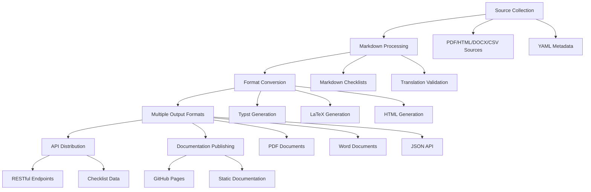

# Repository Map for Standards Checklists

## 1. Overview

The Standards Checklists repository is a comprehensive collection of academic publication checklists designed to improve the quality and transparency of research reporting. The repository provides a pipeline for collecting, processing, and distributing standardized checklists in multiple formats including Markdown, Typst, LaTeX, and through an API.

The project focuses on checklists from the EQUATOR network and related initiatives, providing tools to validate, convert, and publish these standards in various formats for researchers, editors, and institutions.

## 2. Architecture

The repository follows a multi-stage pipeline architecture:



## 3. Core Components

### 3.1 Data Pipeline

The repository implements a four-stage pipeline:
1. **Source Collection**: Raw checklists in various formats (PDF, HTML, DOCX, CSV) stored in `source/`
2. **Markdown Processing**: Canonical Markdown versions in `markdown/`
3. **Format Conversion**: Generation of Typst, LaTeX, and other formats
4. **Distribution**: API endpoints and documentation publishing

### 3.2 Directory Structure

```
standards_check/
├── source/                 # Raw checklist sources and metadata
│   ├── archetypes/         # High-level checklists
│   ├── variants/           # Discipline-specific variants
│   └── index.yml           # Central checklist registry
├── markdown/               # Canonical Markdown versions
│   ├── archetypes/         # High-level checklists
│   └── variants/           # Discipline-specific variants
├── typst/                  # Typst format versions
├── latex/                  # LaTeX format versions
├── html/                   # HTML format versions
├── api/                    # REST API server
├── scripts/                # Processing and validation tools
├── schemas/                # Data validation schemas
├── templates/              # Document templates
└── docs/                   # Generated documentation
```

## 4. Technology Stack

### 4.1 Core Technologies
- **Node.js**: Primary runtime environment for scripts and API
- **Express.js**: Web framework for REST API
- **Pandoc**: Document conversion engine
- **Make**: Build automation tool
- **Bash**: Scripting for automation tasks
- **YAML**: Metadata storage format

### 4.2 Dependencies
- **marked**: Markdown parsing library
- **js-yaml**: YAML parsing library
- **cors**: Cross-origin resource sharing middleware

## 5. Data Model

### 5.1 Checklist Structure
Each checklist follows a standardized structure:
- **Metadata**: Title, version, publisher, license, etc.
- **Sections**: Organized headings for different checklist categories
- **Items**: Individual checklist items within sections

### 5.2 Index Schema
The central `source/index.yml` file maintains metadata for all checklists:
- `id`: Unique kebab-case identifier
- `title`: Official checklist name
- `url`: Canonical URL to the checklist
- `version`: Release version
- `date`: Release date
- `license`: Usage terms
- `publisher`: Owning organization
- `level`: Classification (archetype/variant)
- `group`: Checklist family/type
- `status`: Processing status

### 5.3 Sidecar Metadata Schema
Each checklist in `source/` has a corresponding YAML sidecar file with detailed metadata:
- **Core metadata**: `id`, `title`, `group`, `version`, `date`, `publisher`, `source_url`, `retrieved_at`, `preferred_format`, `checksum`, `license`
- **Citation metadata**: Optional `citation` block with structured bibliographic information
- **Validation**: Schema defined in `schemas/sidecar.schema.json`

## 6. API Endpoints

### 6.1 REST API Server
Located in `api/server.js`, provides programmatic access to checklist data.

#### Endpoints:
- `GET /api/checklists`: Retrieve all checklists
- `GET /api/checklists/:id`: Retrieve a specific checklist by ID

#### Response Format:
```json
{
  "id": "checklist-id",
  "title": "Checklist Title",
  "items": [
    {
      "section": "Section Name",
      "item": "Checklist item text"
    }
  ]
}
```

## 7. Implementation Stages

### 7.1 Current Implementation Status

Based on examination of the repository files, the project is in the middle stages of implementation with substantial progress on the foundational infrastructure and content:

1. **Phase 1 - Equator Mapping** (Complete):
   - Defined scope of checklists to include (CONSORT, PRISMA, STROBE, etc.)
   - Created comprehensive index schema in `source/index.yml` with 16+ checklist entries
   - Collected official URLs and recorded versions for all major checklists
   - Recorded licensing/usage terms for each checklist
   - Captured alternates (PDF/HTML/DOCX) and preferred formats

2. **Phase 2 - Sourcing** (Partially Complete):
   - Downloaded preferred originals to `source/archetypes/` for most checklists
   - Created sidecar metadata files (YAML) for most checklists with source information
   - Verified checksums and file integrity for several checklists
   - Updated `source/index.yml` with file paths and checksums for many entries

3. **Phase 3 - Markdown Creation** (Partially Complete):
   - Created Markdown versions in `markdown/archetypes/` for most checklists
   - Used templates to structure content with proper headings
   - Preserved numbering and section headings matching the source
   - Ran validation scripts and fixed formatting issues

4. **Cycles 2-7** (In Progress/Planned):
   - Expanding archetypes with additional high-level checklists
   - Creating variants for discipline-specific extensions
   - Planning interactive web portal implementation
   - Adding future checklists

### 7.2 Implementation Progress Metrics

Based on file analysis:

- **Index completeness**: ~90% - The `source/index.yml` contains comprehensive metadata for 16+ major checklist types
- **Source files**: ~75% - Most checklist source files (PDF/DOCX) have been downloaded to `source/archetypes/`
- **Sidecar metadata**: ~70% - YAML metadata files exist for most checklists, though some are incomplete
- **Markdown versions**: ~80% - Markdown files have been created for most checklists in `markdown/archetypes/`
- **API functionality**: 100% - REST API server is fully implemented and functional
- **Validation scripts**: 100% - All validation tools are in place and functional
- **Build pipeline**: 100% - Complete Pandoc-based build system with Makefile automation

### 7.3 Remaining Implementation Gaps

Based on analysis of the repository, several key gaps remain:

1. **Incomplete citation metadata**: Several YAML files are missing complete citation information
2. **TBD values**: Some files still contain "TBD" placeholders that need to be filled
3. **Incomplete sidecar files**: Some YAML metadata files are missing required fields
4. **Missing source files**: A few checklist source documents still need to be downloaded
5. **Variant checklists**: Discipline-specific variants have not yet been created
6. **Interactive web portal**: The planned web interface has not been implemented

### 7.2 Development Cycles

The project follows a cyclical development approach:

- **Cycle 1**: Archetypes (high-level checklists only)
- **Cycle 2**: Expand archetypes (discover additional high-level checklists)
- **Cycle 3**: Variants (iterate through all extensions/variants by checklist type)
- **Cycle 4**: Future checklists
- **Cycle 7**: Interactive web portal

### 7.3 Validation and Quality Assurance

The repository includes several validation mechanisms:

- **Markdown validation** (`scripts/validate_md.sh`): Ensures proper formatting and naming conventions
- **Index validation** (`scripts/validate_index.sh`): Checks consistency of the central index
- **Sidecar validation** (`scripts/validate_sidecars.sh`): Validates metadata files
- **Repository validation** (`scripts/validate_repo.sh`): Runs all validations together

### 7.4 Roadmap Items

Current roadmap focuses on:

1. **Data Quality Initiative**:
   - Fix broken links identified by validation scripts
   - Enhance schema validation for YAML files

2. **Tooling & Automation**:
   - Fully implement `find_latest_checklist.py` for discovering new versions
   - Automated documentation generation (partially complete)

3. **Content Expansion**:
   - Ingest new checklists using enhanced discovery tools

## 8. Implementation Plan

### 8.1 Phase 1: Complete Citation Metadata (2-3 weeks)

**Objective**: Complete citation metadata for all existing checklist YAML files

**Tasks**:
1. Identify all YAML files with incomplete citation metadata (based on `todos/references-workflow.md`)
2. Research and collect complete citation information for each checklist:
   - DOI
   - Full author list
   - Journal/Publisher
   - Publication year
   - Volume, issue, and page numbers
3. Update YAML files with complete citation metadata following the schema in `schemas/sidecar.schema.json`
4. Validate all updated YAML files using existing validation scripts

**Files to update**:
- `source/archetypes/spirit-2025.yml`
- `source/archetypes/stard-2015.yml`
- `source/archetypes/tripod-ai-2024.yml`
- `source/archetypes/coreq-2007.yml`
- `source/archetypes/tidier-2014.yml`
- `source/archetypes/srqr-2014.yml`
- `source/archetypes/squire-2016.yml`
- `source/archetypes/moose-2000.yml`

### 8.2 Phase 2: Resolve TBD Values (1 week)

**Objective**: Eliminate all "TBD" placeholder values in the repository

**Tasks**:
1. Run `scripts/list_tbd.sh` to identify all remaining TBD values
2. Research and fill in all TBD values in YAML files
3. Update `source/index.yml` with verified information where TBD values exist
4. Validate all changes

### 8.3 Phase 3: Complete Missing Source Files (1-2 weeks)

**Objective**: Ensure all checklist entries in `source/index.yml` have corresponding source files

**Tasks**:
1. Cross-reference `source/index.yml` with actual files in `source/archetypes/`
2. Identify missing source files
3. Download missing source documents using `scripts/ingest_source.sh`
4. Create corresponding sidecar YAML files
5. Verify checksums and update metadata

### 8.4 Phase 4: Create Variant Checklists (3-4 weeks)

**Objective**: Implement discipline-specific variant checklists

**Tasks**:
1. Identify high-priority variants based on user demand and EQUATOR network recommendations
2. Create directory structure in `source/variants/`, `markdown/variants/`, etc.
3. Follow the same workflow as archetypes for each variant:
   - Add to `source/index.yml` with `level: variant` and `variant_of` field
   - Download source files
   - Create sidecar metadata
   - Create Markdown versions
   - Generate other formats
4. Validate all new variant checklists

### 8.5 Phase 5: Implement Interactive Web Portal (4-6 weeks)

**Objective**: Create a web-based interface for browsing and using checklists

**Tasks**:
1. Design web portal UI/UX
2. Implement frontend using modern web technologies
3. Connect to existing API endpoints
4. Add interactive features:
   - Checklist completion tracking
   - Export functionality
   - Search and filtering
   - User accounts/preferences
5. Deploy to hosting platform
6. Test and iterate

## 8. Workflow Issues

### 8.1 Incorrect Implementation Pattern

There is a known issue where agents are incorrectly implementing aspects such as references directly, rather than following the proper workflow:

1. **Populating `index.yml` fully** - Agents should first ensure the central index is complete with all checklist metadata
2. **Creating sidecar files** - Each checklist should have a corresponding YAML metadata file in the `source/` directory
3. **Adding citation metadata** - Bibliographic information should be added to the sidecar files, not implemented directly
4. **Triggering the workflow** - The proper sequence should be followed: index → sidecars → markdown → formats

### 8.2 Root Cause Analysis

The issue occurs because:
- Agents may not understand the pipeline architecture and data flow
- The citation workflow is not clearly documented as part of the main pipeline
- There is no enforcement mechanism to ensure proper sequence
- Agents may be optimizing for immediate results rather than following the established process

### 8.3 Correct Workflow for References

The proper workflow for adding citation metadata is:

1. **Complete the index**: Ensure `source/index.yml` contains all checklist entries
2. **Create sidecar files**: Use `scripts/sidecar_new.sh` to generate template YAML files
3. **Ingest sources**: Use `scripts/ingest_source.sh` to download originals and populate basic metadata
4. **Add citation data**: Manually add citation metadata to the YAML sidecar files
5. **Validate**: Run validation scripts to ensure schema compliance
6. **Generate citations**: Use `scripts/generate_citations.sh` to create bibliographic files
7. **Proceed with content creation**: Only then create Markdown versions

## 9. Build and Deployment

### 9.1 Build Process
- **Validation**: Scripts validate Markdown, index, and sidecar files
- **Conversion**: Pandoc converts Markdown to multiple formats
- **Generation**: API data and documentation indexes are generated

### 9.2 Automation
- **GitHub Actions**: Continuous integration for building documents
- **Makefile**: Local build targets for common operations
- **Scripts**: Custom automation tools for ingestion and validation

### 9.3 Publishing
- **GitHub Pages**: Hosts static documentation
- **API**: Serves checklist data programmatically
- **Artifacts**: Generated PDF, DOCX, and LaTeX files

## 10. Quality Assurance

### 10.1 Validation Tools
- **Markdown validation**: Ensures proper formatting
- **Schema validation**: Validates YAML metadata against schemas
- **Link validation**: Checks for broken URLs
- **Index validation**: Ensures consistency with source files

### 10.2 Testing Strategy
- **Unit tests**: Validate individual script functionality
- **Integration tests**: Verify end-to-end pipeline operations
- **Validation scripts**: Automated quality checks

## 11. Contribution Workflow

### 11.1 Adding New Checklists
1. Add source file to `source/archetypes/` or `source/variants/`
2. Create Markdown version in corresponding `markdown/` directory
3. Generate Typst and LaTeX versions
4. Update `source/index.yml` with metadata
5. Validate all files

### 11.2 Standards and Guidelines
- Follow naming conventions (kebab-case identifiers)
- Maintain consistent formatting across formats
- Include proper metadata and citations
- Validate before submitting pull requests